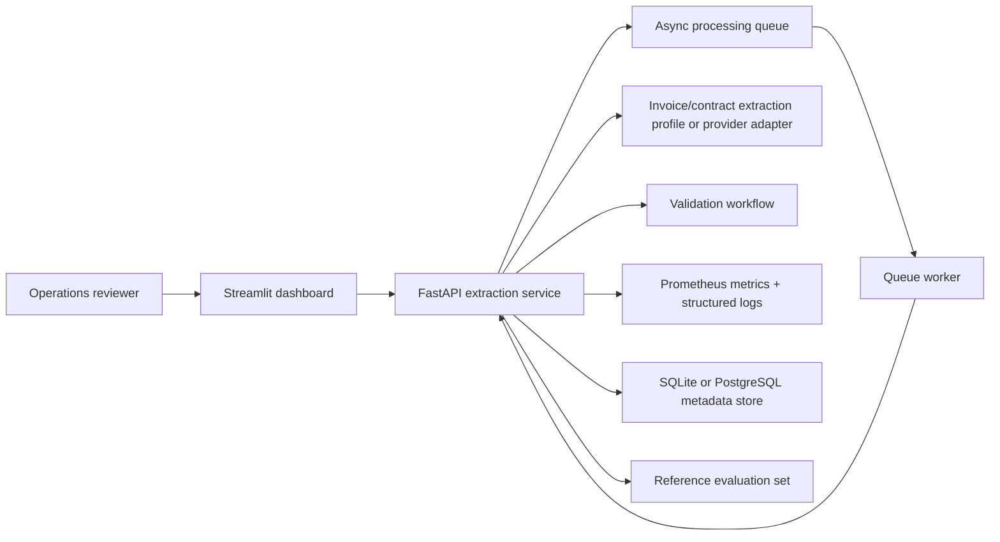
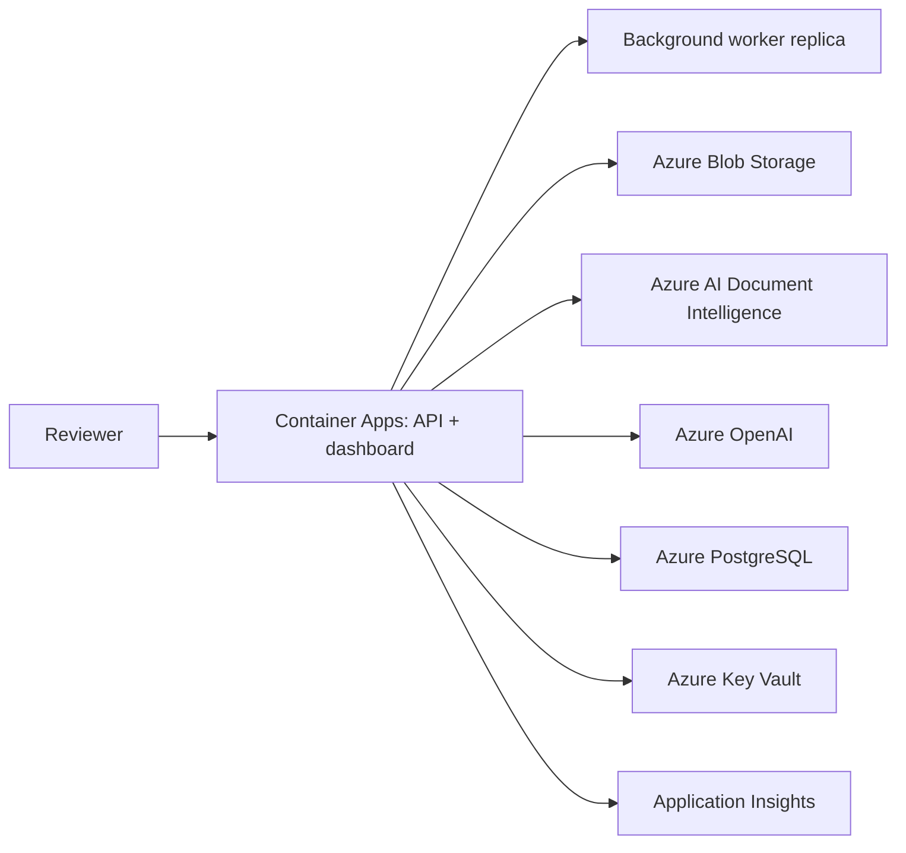

# Architecture

## Local Runtime

```mermaid
flowchart LR
    Reviewer["Operations reviewer"] --> Dashboard["Streamlit dashboard"]
    Dashboard --> Service["FastAPI extraction service"]
    Service --> Queue["Async processing queue"]
    Queue --> Worker["Queue worker"]
    Worker --> Service
    Service --> Extract["Invoice/contract extraction profile or provider adapter"]
    Service --> Validate["Validation workflow"]
    Service --> Metrics["Prometheus metrics + structured logs"]
    Service --> Storage["SQLite or PostgreSQL metadata store"]
    Service --> Eval["Reference evaluation set"]
```

## Azure-Ready Deployment

```mermaid
flowchart LR
    User["Reviewer"] --> App["Container Apps: API + dashboard"]
    App --> Worker["Background worker replica"]
    App --> Blob["Azure Blob Storage"]
    App --> DocIntel["Azure AI Document Intelligence"]
    App --> AzureOpenAI["Azure OpenAI"]
    App --> DB["Azure PostgreSQL"]
    App --> KV["Azure Key Vault"]
    App --> Insights["Application Insights"]
```
