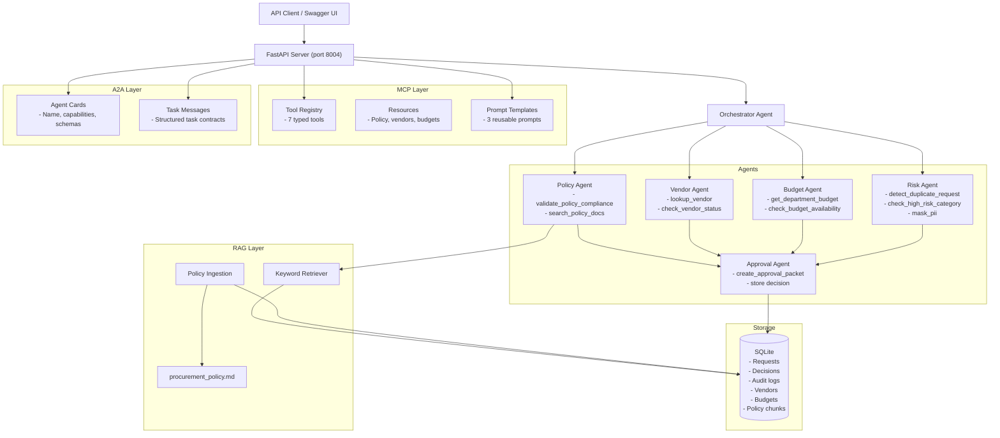
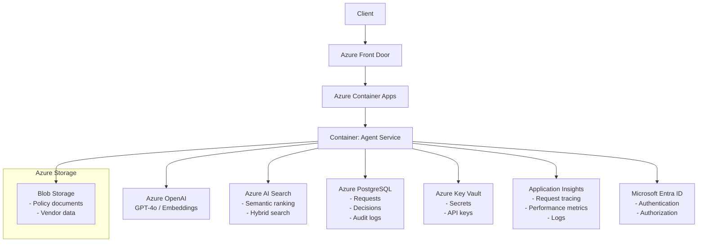

# Architecture

## Local Architecture

```mermaid
flowchart TB
    Client["API Client / Swagger UI"] --> FastAPI["FastAPI Server (port 8004)"]
    FastAPI --> Orchestrator["Orchestrator Agent"]

    subgraph Agents
        Policy["Policy Agent<br/>- validate_policy_compliance<br/>- search_policy_docs"]
        Vendor["Vendor Agent<br/>- lookup_vendor<br/>- check_vendor_status"]
        Budget["Budget Agent<br/>- get_department_budget<br/>- check_budget_availability"]
        Risk["Risk Agent<br/>- detect_duplicate_request<br/>- check_high_risk_category<br/>- mask_pii"]
        Approval["Approval Agent<br/>- create_approval_packet<br/>- store decision"]
    end

    subgraph MCP_Layer["MCP Layer"]
        Tools["Tool Registry<br/>- 7 typed tools"]
        Resources["Resources<br/>- Policy, vendors, budgets"]
        Prompts["Prompt Templates<br/>- 3 reusable prompts"]
    end

    subgraph A2A_Layer["A2A Layer"]
        Cards["Agent Cards<br/>- Name, capabilities, schemas"]
        Tasks["Task Messages<br/>- Structured task contracts"]
    end

    subgraph Storage["Storage"]
        SQLite[("SQLite<br/>- Requests<br/>- Decisions<br/>- Audit logs<br/>- Vendors<br/>- Budgets<br/>- Policy chunks")]
    end

    subgraph RAG["RAG Layer"]
        PolicyDoc["procurement_policy.md"]
        Ingest["Policy Ingestion"]
        Retriever["Keyword Retriever"]
    end

    Orchestrator --> Policy
    Orchestrator --> Vendor
    Orchestrator --> Budget
    Orchestrator --> Risk
    Policy --> Approval
    Vendor --> Approval
    Budget --> Approval
    Risk --> Approval

    Policy --> Retriever
    Retriever --> SQLite
    Ingest --> PolicyDoc
    Ingest --> SQLite

    Approval --> SQLite
    FastAPI --> Tools
    FastAPI --> Prompts
    FastAPI --> Cards
    FastAPI --> Tasks
```

## Future Azure Architecture

```mermaid
flowchart TB
    Client["Client"] --> AFD["Azure Front Door"]
    AFD --> ACA["Azure Container Apps"]
    ACA --> AAgents["Container: Agent Service"]

    AAgents --> AOAI["Azure OpenAI<br/>GPT-4o / Embeddings"]
    AAgents --> AISearch["Azure AI Search<br/>- Semantic ranking<br/>- Hybrid search"]
    AAgents --> PG["Azure PostgreSQL<br/>- Requests<br/>- Decisions<br/>- Audit logs"]
    AAgents --> KV["Azure Key Vault<br/>- Secrets<br/>- API keys"]

    AAgents --> Monitor["Application Insights<br/>- Request tracing<br/>- Performance metrics<br/>- Logs"]

    subgraph Storage["Azure Storage"]
        Blob["Blob Storage<br/>- Policy documents<br/>- Vendor data"]
    end

    AAgents --> Blob
    AAgents --> Entra["Microsoft Entra ID<br/>- Authentication<br/>- Authorization"]
```
